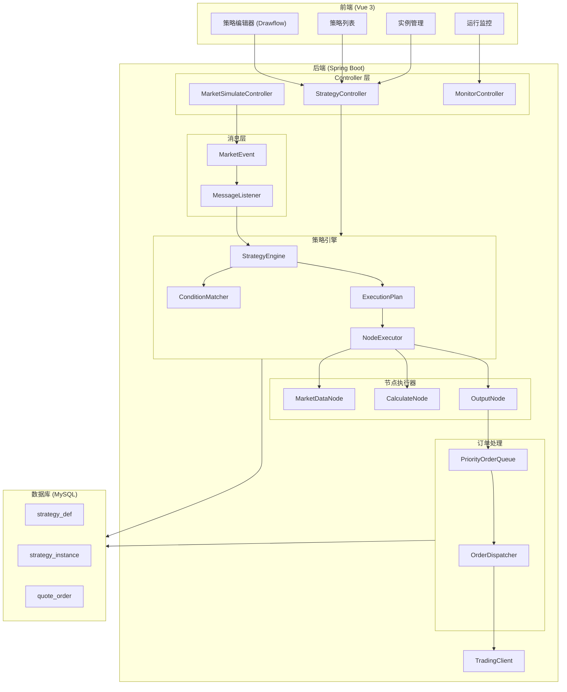
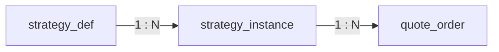
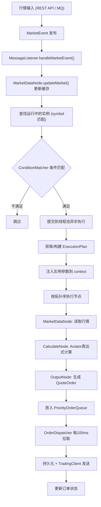
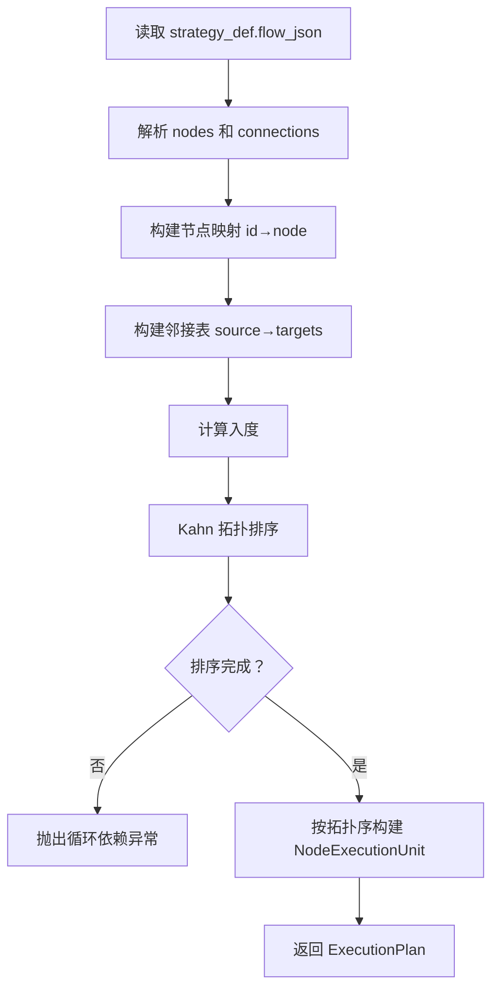

# Auto Quote Engine 项目 Wiki

## 目录

- [1. 项目概述](#1-项目概述)
- [2. 系统架构](#2-系统架构)
- [3. 技术栈](#3-技术栈)
- [4. 环境要求与部署](#4-环境要求与部署)
- [5. 数据库设计](#5-数据库设计)
- [6. 后端模块详解](#6-后端模块详解)
    - [6.1 策略引擎核心 (engine)](#61-策略引擎核心-engine)
    - [6.2 消息处理 (messaging)](#62-消息处理-messaging)
    - [6.3 订单队列与分发 (queue)](#63-订单队列与分发-queue)
    - [6.4 交易对接 (trading)](#64-交易对接-trading)
    - [6.5 数据模型 (model)](#65-数据模型-model)
    - [6.6 服务层 (service)](#66-服务层-service)
    - [6.7 数据访问层 (repository)](#67-数据访问层-repository)
    - [6.8 控制器 (controller)](#68-控制器-controller)
    - [6.9 工具类 (util)](#69-工具类-util)
- [7. 前端模块详解](#7-前端模块详解)
    - [7.1 路由设计](#71-路由设计)
    - [7.2 页面视图](#72-页面视图)
    - [7.3 流程图组件](#73-流程图组件)
    - [7.4 API 封装](#74-api-封装)
- [8. API 接口文档](#8-api-接口文档)
- [9. 核心流程](#9-核心流程)
- [10. 流程图 JSON 数据格式](#10-流程图-json-数据格式)
- [11. 触发条件格式](#11-触发条件格式)
- [12. 构建与运行](#12-构建与运行)

---

## 1. 项目概述

**Auto Quote Engine（自动报价引擎）** 是一个基于可视化策略流程图的自动报价决策系统。用户可以通过前端拖拽式编辑器定义策略流程图，系统根据实时行情数据，按照流程图逻辑自动计算并生成报价订单，最终推送至交易系统。

### 核心能力

| 能力 | 说明 |
|------|------|
| **可视化策略编辑** | 基于 Drawflow 的拖拽式流程图编辑器，支持自定义节点和连线 |
| **策略实例管理** | 基于同一策略定义创建多个实例，支持不同标的、参数和触发条件 |
| **行情驱动执行** | 接收实时行情事件，匹配触发条件后自动执行策略流程图 |
| **优先级订单队列** | 基于 `PriorityBlockingQueue` 的订单排队与批量分发 |
| **运行监控** | 实时查看队列深度和订单状态 |

### 系统角色

| 角色 | 说明 |
|------|------|
| **策略定义者** | 通过前端编辑器创建/编辑策略流程图 |
| **实例管理者** | 创建策略实例，配置标的、优先级、触发条件和参数 |
| **行情数据提供方** | 通过 API 或事件机制推送行情数据 |
| **监控者** | 查看订单队列和成交情况 |

---

## 2. 系统架构




### 整体数据流

```
行情输入 → MarketEvent → MessageListener → StrategyEngine
    → ConditionMatcher (条件匹配)
    → ExecutionPlan (拓扑排序执行流程图)
        → MarketDataNode (获取行情)
        → CalculateNode (Aviator 表达式计算)
        → OutputNode (生成订单)
    → PriorityOrderQueue (优先级队列)
    → OrderDispatcher (定时批量拉取)
    → TradingClient (推送交易)
```


---

## 3. 技术栈

### 后端

| 技术 | 版本 | 用途 |
|------|------|------|
| **Java** | 1.8 | 编程语言 |
| **Spring Boot** | 2.2.6 | 应用框架 |
| **Spring Data JPA** | - | ORM 数据访问 |
| **Spring Data Redis** | - | 缓存（可选，当前未启用） |
| **MySQL** | - | 关系型数据库 |
| **Flyway** | - | 数据库迁移 |
| **Aviator** | 5.2.7 | 表达式引擎（用于计算节点） |
| **Lombok** | - | 简化 POJO 代码 |
| **Jackson** | - | JSON 序列化/反序列化 |

### 前端

| 技术 | 版本 | 用途 |
|------|------|------|
| **Vue** | 3.2 | 前端框架 |
| **Vue Router** | 4.0 | 路由管理 |
| **Vuex** | 4.0 | 状态管理（已引入，当前为空） |
| **Element Plus** | 2.2 | UI 组件库 |
| **Drawflow** | 0.0.59 | 可视化流程图编辑器 |
| **Axios** | 0.26 | HTTP 客户端 |
| **Vite** | 2.8 | 构建工具 |

---

## 4. 环境要求与部署

### 环境要求

| 组件 | 最低版本 |
|------|----------|
| JDK | 1.8 |
| Maven | 3.6+ |
| MySQL | 5.7+ |
| Node.js | 14+ |
| npm | 6+ |

### 部署步骤

#### 1. 数据库准备

```sql
CREATE DATABASE aqe;
```


修改 `backend/src/main/resources/application.yml` 中的数据库连接信息：

```yaml
spring:
  datasource:
    url: jdbc:mysql://<HOST>:<PORT>/aqe?useSSL=false&allowPublicKeyRetrieval=true&serverTimezone=UTC
    username: <USERNAME>
    password: <PASSWORD>
```


> Flyway 启动时会自动执行迁移脚本 `V1__init.sql`。

#### 2. 启动后端

```bash
cd backend
mvn spring-boot:run
```


或直接运行 `AutoQuoteEngineApplication.java`，默认端口 **8080**。

#### 3. 启动前端

```bash
cd frontend
npm install
npm run dev
```


访问 `http://localhost:3000`（Vite 配置端口为 3000）。

> 前端已配置代理，`/api` 开头的请求会自动转发到 `http://localhost:8080`。

---

## 5. 数据库设计

### ER 关系图




### 5.1 strategy_def（策略定义表）

| 字段 | 类型 | 约束 | 说明 |
|------|------|------|------|
| `id` | bigint | PK, AUTO_INCREMENT | 主键 |
| `name` | varchar(100) | NOT NULL | 策略名称 |
| `flow_json` | json | NOT NULL | 流程图 JSON 数据 |
| `create_time` | datetime | DEFAULT CURRENT_TIMESTAMP | 创建时间 |

### 5.2 strategy_instance（策略实例表）

| 字段 | 类型 | 约束 | 说明 |
|------|------|------|------|
| `id` | bigint | PK, AUTO_INCREMENT | 主键 |
| `strategy_def_id` | bigint | FK → strategy_def.id | 关联策略定义 |
| `symbol` | varchar(20) | NOT NULL | 交易标的代码 |
| `status` | tinyint | DEFAULT 1 | 状态：0-停止，1-运行 |
| `params` | json | - | 实例参数覆盖（如 multiplier） |
| `priority` | int | DEFAULT 5 | 优先级（1-10，数值越大越优先） |
| `trigger_conditions` | json | - | 触发条件 JSON |
| `create_time` | datetime | DEFAULT CURRENT_TIMESTAMP | 创建时间 |

### 5.3 quote_order（报价订单表）

| 字段 | 类型 | 约束 | 说明 |
|------|------|------|------|
| `id` | bigint | PK, AUTO_INCREMENT | 主键 |
| `instance_id` | bigint | FK → strategy_instance.id | 关联策略实例 |
| `side` | tinyint | - | 方向：1-买，2-卖 |
| `price` | decimal(16,8) | - | 价格 |
| `volume` | int | - | 数量 |
| `priority` | int | - | 优先级 |
| `status` | tinyint | DEFAULT 0 | 状态：0-排队，1-已推送，2-已成交，3-失败 |
| `create_time` | datetime | DEFAULT CURRENT_TIMESTAMP | 创建时间 |

---

## 6. 后端模块详解

### 后端包结构

```
com.aqe
├── AutoQuoteEngineApplication.java    # 启动类（@EnableScheduling）
├── controller/                         # REST 控制器
│   ├── StrategyController.java         # 策略定义 & 实例 CRUD
│   ├── MarketSimulateController.java   # 行情模拟端点
│   └── MonitorController.java          # 监控（队列深度、订单查询）
├── engine/                             # 策略引擎核心
│   ├── StrategyEngine.java             # 引擎主类（构建执行计划、调度执行）
│   ├── NodeExecutor.java               # 节点执行器接口
│   ├── ExecutionPlan.java              # 执行计划（有序节点列表）
│   ├── ConditionMatcher.java           # 触发条件匹配器
│   └── impl/                           # 节点执行器实现
│       ├── MarketDataNode.java          # 行情数据节点
│       ├── CalculateNode.java           # 计算节点（Aviator 表达式）
│       └── OutputNode.java             # 输出节点（生成订单）
├── messaging/                          # 消息事件
│   ├── MarketEvent.java                # 行情事件
│   └── MessageListener.java            # 事件监听器
├── model/entity/                       # JPA 实体
│   ├── StrategyDef.java
│   ├── StrategyInstance.java
│   └── QuoteOrder.java
├── repository/                         # JPA Repository
│   ├── StrategyDefRepository.java
│   ├── StrategyInstanceRepository.java
│   └── QuoteOrderRepository.java
├── service/                            # 业务服务
│   ├── StrategyDefService.java
│   ├── StrategyInstanceService.java
│   └── QuoteOrderService.java
├── queue/                              # 订单队列
│   ├── PriorityOrderQueue.java         # 优先级队列封装
│   └── OrderDispatcher.java            # 定时订单分发器
├── trading/                            # 交易对接
│   └── TradingClient.java              # 交易客户端（模拟）
└── util/
    └── NodeExecutionUnit.java           # 节点执行单元（执行器 + 属性）
```


---

### 6.1 策略引擎核心 (engine)

#### NodeExecutor 接口

所有节点执行器的统一接口：

```java
public interface NodeExecutor {
    Object execute(Map<String, Object> context, Map<String, Object> properties);
}
```


- `context`：执行上下文，贯穿整个执行计划，节点间通过 context 传递数据（key 为节点 ID）
- `properties`：节点自身属性（从 flow_json 中解析）

#### StrategyEngine

引擎核心类，负责：

1. **接收行情事件** (`onMarketEvent`)：更新行情缓存，查找运行中的实例，匹配触发条件后提交到线程池异步执行
2. **构建执行计划** (`buildPlan`)：
    - 解析 `flow_json` 中的 `nodes` 和 `connections`
    - 构建有向图邻接表
    - 使用 **Kahn 算法** 进行拓扑排序
    - 检测循环依赖
    - 按拓扑序将每个节点封装为 `NodeExecutionUnit`
3. **执行实例** (`executeInstance`)：
    - 从 `planCache`（ConcurrentHashMap 缓存）获取或构建执行计划
    - 将实例参数（如 multiplier）注入 context
    - 按拓扑序依次执行各节点

**线程池配置**：核心 4 线程，最大 20 线程，队列容量 1000，拒绝策略为 CallerRunsPolicy。

#### ExecutionPlan

执行计划，包含有序的 `NodeExecutionUnit` 列表。执行时按顺序调用每个节点，并将结果以节点 ID 为 key 存入 context。

#### ConditionMatcher

条件匹配器（静态工具类），支持：

- **AND** 组合：所有条件都满足
- **OR** 组合：任一条件满足
- **单条件**：直接匹配

支持字段：`price`（价格）、`volume`（量）
支持操作符：`>`、`<`、`>=`、`<=`、`==`

---

### 6.2 消息处理 (messaging)

基于 Spring 的 `ApplicationEvent` 机制：

- **MarketEvent**：行情事件，包含 `symbol`、`price`、`volume`
- **MessageListener**：监听 `MarketEvent`，调用 `StrategyEngine.onMarketEvent()` 处理

行情来源可以是：
- `MarketSimulateController` 的 REST API（手动模拟）
- 未来可对接 MQ（如 RabbitMQ/Kafka）

---

### 6.3 订单队列与分发 (queue)

#### PriorityOrderQueue

基于 `PriorityBlockingQueue<QuoteOrder>` 的优先级队列。`QuoteOrder` 实现了 `Comparable` 接口，按 priority **降序** 排列（高优先级先出队）。

#### OrderDispatcher

定时任务（`@Scheduled(fixedDelay = 100)`），每 **100ms** 从队列中批量拉取最多 **50** 笔订单：

1. 调用 `QuoteOrderService.save()` 持久化
2. 调用 `TradingClient.sendOrder()` 发送交易
3. 根据结果更新订单状态（1-成功，3-失败）

---

### 6.4 交易对接 (trading)

**TradingClient** 是交易系统的对接层，当前为模拟实现（90% 成功率）。实际部署时替换为真实交易 API 调用。

---

### 6.5 数据模型 (model)

| 实体 | 对应表 | 关键特性 |
|------|--------|----------|
| `StrategyDef` | strategy_def | `flowJson` 存储流程图 JSON |
| `StrategyInstance` | strategy_instance | `params`/`triggerConditions` 为 JSON 字段 |
| `QuoteOrder` | quote_order | 实现 `Comparable`，支持优先级排序 |

---

### 6.6 服务层 (service)

| 服务 | 职责 |
|------|------|
| `StrategyDefService` | 策略定义的保存和查询 |
| `StrategyInstanceService` | 实例 CRUD、按标的查运行实例、状态切换 |
| `QuoteOrderService` | 订单保存和查询 |

---

### 6.7 数据访问层 (repository)

均继承 `JpaRepository`，提供标准 CRUD 方法：

| Repository | 自定义方法 |
|------------|-----------|
| `StrategyDefRepository` | 无 |
| `StrategyInstanceRepository` | `findBySymbolAndStatus(symbol, status)` |
| `QuoteOrderRepository` | 无 |

---

### 6.8 控制器 (controller)

详见 [API 接口文档](#8-api-接口文档)。

---

### 6.9 工具类 (util)

**NodeExecutionUnit**：将 `NodeExecutor` 和节点属性 `properties` 封装为一个执行单元，供 `ExecutionPlan` 顺序执行。

---

## 7. 前端模块详解

### 前端目录结构

```
frontend/src/
├── main.js                     # 入口：注册 Vue、Router、Vuex、ElementPlus
├── App.vue                     # 根组件：顶部导航 + router-view
├── api/
│   └── index.js                # Axios 封装 & API 方法
├── router/
│   └── index.js                # 路由配置
├── store/
│   └── index.js                # Vuex Store（当前为空）
├── components/
│   └── DrawflowWrapper.vue     # Drawflow 流程图编辑器封装
└── views/
    ├── StrategyList.vue        # 策略列表页
    ├── StrategyEditor.vue      # 策略编辑页（流程图）
    ├── InstanceManage.vue      # 实例管理页
    └── Monitor.vue             # 运行监控页
```


---

### 7.1 路由设计

| 路径 | 组件 | 说明 |
|------|------|------|
| `/` | → 重定向到 `/strategies` | 默认页 |
| `/strategies` | `StrategyList.vue` | 策略定义列表 |
| `/editor/:id?` | `StrategyEditor.vue` | 策略编辑器（新建/编辑） |
| `/instances` | `InstanceManage.vue` | 实例管理 |
| `/monitor` | `Monitor.vue` | 运行监控 |

---

### 7.2 页面视图

#### StrategyList（策略列表）

- 展示所有策略定义（ID、名称、创建时间）
- 操作：「编辑」跳转到编辑器，「创建实例」跳转到实例管理页

#### StrategyEditor（策略编辑器）

- 输入策略名称
- 嵌入 Drawflow 流程图编辑器
- 「保存策略」按钮：将流程图 `export()` 数据序列化为 JSON 提交后端

#### InstanceManage（实例管理）

- 上半部分：创建实例表单
    - 选择策略定义（下拉框）
    - 输入标的代码（默认 AAPL）
    - 设置优先级（1-10）
    - 配置触发条件（JSON 格式）
    - 配置参数覆盖（JSON 格式，如 `{"multiplier":"0.98"}`）
- 下半部分：实例列表，支持启动/停止操作

#### Monitor（运行监控）

- 实时显示队列深度
- 展示最近 100 笔订单（ID、实例ID、方向、价格、数量、状态、时间）
- 每 **2 秒** 自动刷新

---

### 7.3 流程图组件

**DrawflowWrapper.vue** 封装了 Drawflow 库：

- 在 `onMounted` 中初始化 Drawflow 编辑器
- 监听 `nodeMoved`、`connectionCreated`、`nodeRemoved` 事件，通过 `update` 事件向父组件同步数据
- 暴露 `exportData()` 方法供父组件获取流程图数据

---

### 7.4 API 封装

基于 Axios，`baseURL` 为 `/api`，通过 Vite 代理转发到后端 `8080` 端口。

```javascript
// 策略相关 API
strategyApi.saveDef(data)           // POST /api/strategy/def
strategyApi.listDef()               // GET  /api/strategy/def
strategyApi.createInstance(data)    // POST /api/strategy/instance
strategyApi.listInstances()         // GET  /api/strategy/instance
strategyApi.updateStatus(id, status)// PUT  /api/strategy/instance/:id/status

// 监控相关 API
monitorApi.getQueueDepth()          // GET /api/monitor/queueDepth
monitorApi.getOrders()              // GET /api/monitor/orders
```


---

## 8. API 接口文档

### 8.1 策略定义

#### 保存策略定义

```
POST /api/strategy/def
Content-Type: application/json

{
  "name": "均线突破策略",
  "flowJson": "{\"nodes\":[...], \"connections\":[...]}"
}

Response: StrategyDef 对象
```


#### 查询所有策略定义

```
GET /api/strategy/def

Response: StrategyDef[]
```


### 8.2 策略实例

#### 创建策略实例

```
POST /api/strategy/instance
Content-Type: application/json

{
  "strategyDefId": 1,
  "symbol": "AAPL",
  "priority": 5,
  "triggerConditions": "{\"type\":\"AND\",\"conditions\":[{\"field\":\"price\",\"operator\":\">\",\"value\":100}]}",
  "params": "{\"multiplier\":\"0.98\"}",
  "status": 0
}

Response: StrategyInstance 对象
```


#### 查询所有实例

```
GET /api/strategy/instance

Response: StrategyInstance[]
```


#### 更新实例状态

```
PUT /api/strategy/instance/{id}/status?status=1

Response: void
```


### 8.3 行情模拟

```
POST /api/market/simulate?symbol=AAPL&price=150.5&volume=1000

Response: "Market event published: AAPL price=150.5 volume=1000"
```


### 8.4 监控

#### 查询队列深度

```
GET /api/monitor/queueDepth

Response: int（当前队列中的订单数量）
```


#### 查询最近订单

```
GET /api/monitor/orders

Response: QuoteOrder[]（最近 100 笔订单）
```


---

## 9. 核心流程

### 9.1 行情驱动报价流程




### 9.2 执行计划构建流程




---

## 10. 流程图 JSON 数据格式

`flow_json` 字段存储 Drawflow 导出的 JSON 数据，核心结构如下：

```json
{
  "nodes": [
    {
      "id": "node1",
      "type": "market",
      "symbol": "AAPL"
    },
    {
      "id": "node2",
      "type": "calculate",
      "expression": "lastPrice * multiplier"
    },
    {
      "id": "node3",
      "type": "output",
      "priceRef": "node2",
      "volumeRef": "100",
      "sideRef": "BUY"
    }
  ],
  "connections": [
    { "source": "node1", "target": "node2" },
    { "source": "node2", "target": "node3" }
  ]
}
```


### 节点类型说明

| 类型 | type 值 | 属性 | 说明 |
|------|---------|------|------|
| 行情数据节点 | `market` | `symbol`：标的代码 | 从缓存读取行情数据 |
| 计算节点 | `calculate` | `expression`：Aviator 表达式 | 使用 context 中的变量进行计算 |
| 输出节点 | `output` | `priceRef`：价格引用<br>`volumeRef`：数量引用<br>`sideRef`：买卖方向 | 生成报价订单并放入队列 |

> `priceRef`/`volumeRef` 可以引用节点 ID（从 context 获取计算结果）或固定数值。

---

## 11. 触发条件格式

`trigger_conditions` 字段为 JSON，支持组合条件：

### 单条件

```json
{
  "field": "price",
  "operator": ">",
  "value": 100
}
```


### AND 组合（所有条件都满足）

```json
{
  "type": "AND",
  "conditions": [
    { "field": "price", "operator": ">", "value": 100 },
    { "field": "volume", "operator": ">=", "value": 500 }
  ]
}
```


### OR 组合（任一条件满足）

```json
{
  "type": "OR",
  "conditions": [
    { "field": "price", "operator": ">", "value": 150 },
    { "field": "price", "operator": "<", "value": 80 }
  ]
}
```


### 支持的字段和操作符

| 字段 | 说明 |
|------|------|
| `price` | 当前行情价格 |
| `volume` | 当前行情成交量 |

| 操作符 | 说明 |
|--------|------|
| `>` | 大于 |
| `<` | 小于 |
| `>=` | 大于等于 |
| `<=` | 小于等于 |
| `==` | 等于（浮点精度 1e-9） |

---

## 12. 构建与运行

### 后端构建

```bash
cd backend
mvn clean package -DskipTests
java -jar target/auto-quote-engine-1.0.0.jar
```


### 前端构建

```bash
cd frontend
npm run build    # 生产构建，输出到 dist/
```


### 配置说明

`application.yml` 关键配置项：

| 配置项 | 默认值 | 说明 |
|--------|--------|------|
| `server.port` | 8080 | 后端服务端口 |
| `spring.datasource.url` | jdbc:mysql://192.168.72.128:3306/aqe | 数据库连接 URL |
| `spring.jpa.hibernate.ddl-auto` | none | 不使用 JPA 自动建表（由 Flyway 管理） |
| `spring.flyway.enabled` | true | 启用 Flyway 迁移 |
| `spring.flyway.baseline-on-migrate` | true | 对已有数据库建立基线 |
| `logging.level.com.aqe` | debug | 日志级别 |

> **注意**：Redis 依赖当前已注释，如需启用可取消 `application.yml` 中 Redis 配置的注释。当前系统不使用 Redis。

---

以上就是 Auto Quote Engine 项目的完整 Wiki。涵盖了项目概述、架构设计、技术栈、数据库设计、后端各模块详解、前端各模块详解、API 文档、核心流程图、数据格式说明以及构建部署指南。