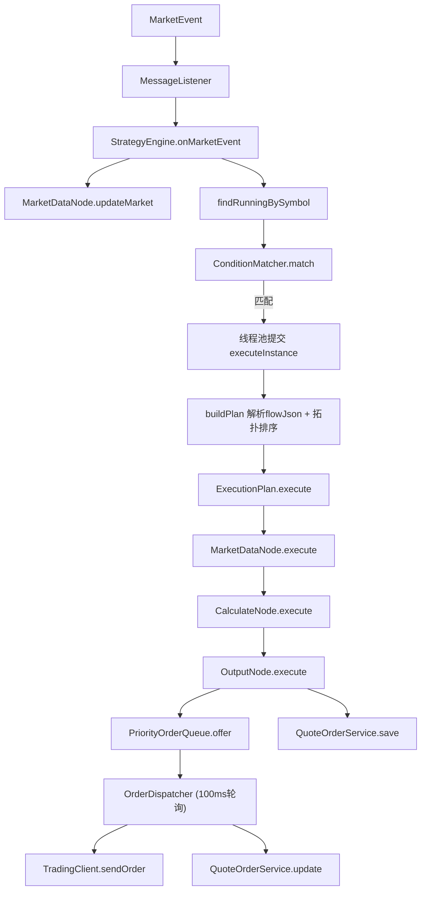

从行情事件到最终下单的全链路代码。

---

## 📋 策略触发下单流程总览

---

## 📝 建议修复优先级

| 优先级 | 问题 | 建议 |
|--------|------|------|
| P0 | `update()` 空方法 | 实现 `repository.save(order)` 的 merge 逻辑 |
| P0 | 订单重复保存 | 只在 OutputNode 或 Dispatcher 其一保存 |
| P1 | buildPlan 无缓存 | 加入 `planCache`，以 defId 为 key，策略变更时清除 |
| P1 | 无执行频率控制 | 给实例加 cooldown 机制 |
| P2 | 事务不一致 | OutputNode 中用 `@Transactional` 包裹，或改为先 save 再入队 |
| P2 | 硬编码 AAPL | 改为抛异常或使用 context 中的 symbol |